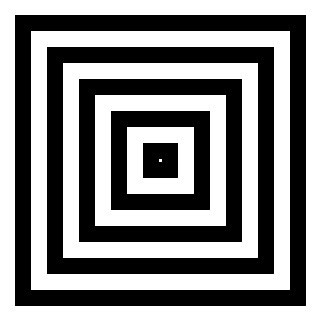

# GifArrows

A simple tool to make various animated GIF arrows:
----------------

Requirements:
-------------

* [GD library](https://metacpan.org/release/GD), known bugs: [#97760](https://rt.cpan.org/Public/Bug/Display.html?id=97760) -> [patch](https://rt.cpan.org/Ticket/Attachment/1409528/748127/animgif-2-1-x.patch)

